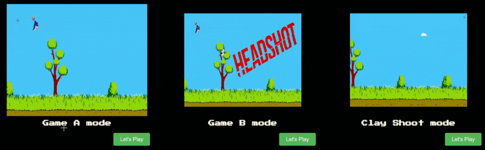

<!-- Intro  -->
<h3 align="center">
        <samp>&gt; 🙏 Namasthey everyone, I'm
                <b><a target="_blank" href="https://doondi gangadhar.com">Doondi</a></b>
        </samp>
</h3>

 
  <samp>
    <a href="https://www.google.com/search?q=doondi+gangadhar">「 Google Me 」</a>
     
    「 I am a MERN stack web application developer from <b>India</b> 」
     
     
  </samp>

<!--Linkedin -->

 
  <!-- Gmail Link -->
 

  <!-- Credly Link -->
  
  

 

 
  

  I'm currently pursuing Computer Science from [Raghu Engineering College](https://raghuenggcollege.com/ "visit my college website").   
 ✌️ &emsp; Enjoy to do programming and sharing knowledge   
 ❤️ &emsp; Love to writing code and learning new features  
 🤩 &emsp; I'm down into projects and collaborations.   

 

<!--Intro Section End-->

<!--Skills Section Start-->

<h3 align="center">
 
 
 
  【SKIᒪᒪS】
</h3>

 
  

 

<!--Stats Section Start-->

<h3 align="center">
 
   
 【STATS】 
</h3>

<!-- Adding Github Stats and Streak Stats -->

|  |  |
| --- | ---- |

<!-- Adding Readme Stats and Profile Summary -->
</a>

<!--Stats Section End-->

<!--Contributions Section Start -->

<h3 align="center">
 
 
 
【CONTRIBUTIONS】
</h3>

<table width="100%" align="center">
<tr>
<td>

</td>
</tr>
</table>

## 🐱‍💻 HOLOPIN BADGES:

 

<!--Gif Section-->

 
<!--Gif Section End -->
 
<!-- Footer Section-->
### sʜᴏᴡ sᴏᴍᴇ 💙 ʙʏ sᴛᴀʀʀɪɴɢ ⭐ sᴏᴍᴇ ᴏғ ᴛʜᴇ ʀᴇᴘᴏsɪᴛᴏʀɪᴇs!

  

  

